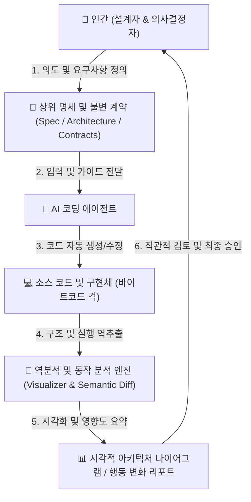

AI 코딩 에이전트가 초당 수백 줄의 코드를 생성하고 자율적으로 수정하는 시대가 열렸습니다. 개발 속도는 폭발적으로 빨라졌지만, 엔지니어링 현장에서는 뜻밖의 거대한 병목이 나타나고 있습니다. 바로 **"사람이 AI의 코드를 한 줄 한 줄 검토하고 유지보수하기가 너무 버겁다"**는 점입니다.

왜 AI가 작성한 코드를 인간이 지속적으로 검토하는 데 극심한 피로가 따르는지, 그리고 학계와 산업계(Martin Fowler, Thoughtworks, Tessl 등)에서는 이를 극복하기 위해 코드를 어떻게 **'사람이 이해하기 쉬운 형태'**로 전환하여 관리하려 하는지 그 최신 흐름을 정리합니다.

---

### 1. 문제 제기: AI 코드 리뷰 피로 (AI Code Review Fatigue)

최근 여러 소프트웨어 공학 연구(arXiv, Thoughtworks 등)는 AI 생성 코드를 리뷰할 때 인간에게 다음과 같은 심각한 인지적 과부하(Cognitive Overload)가 발생한다고 지적합니다.

* **맥락 재구성(Context Reconstruction) 비용:**  
  인간이 직접 설계하고 구현할 때는 머릿속에 시스템의 멘탈 모델이 자연스럽게 형성됩니다. 하지만 AI가 자율적으로 생성한 수백~수천 줄의 코드는 일종의 **'남이 짜놓은 레거시 코드'를 역공학(Reverse Engineering)**하듯 읽어야 하므로 극심한 뇌 피로를 유발합니다.
* **경계 감퇴(Vigilance Decrement)와 "Workslop":**  
  AI 코드는 문법적으로 매우 깔끔하고 그럴듯해 보입니다. 그러나 아키텍처 규칙 위반, 은밀한 엣지 케이스 누락, 성능 저하 등 **'1%의 치명적 결함'**을 잡아내기 위해 리뷰어가 끝없는 긴장 상태(Hyper-vigilance)를 유지해야 하며, 이는 빠른 인지 고갈을 부릅니다.
* **마이크로 의사결정의 누적:**  
  한 줄 한 줄을 수락(Accept), 수정(Edit), 거절(Reject)하는 과정에서 개발자의 집중력이 파편화되고 결정 피로(Decision Fatigue)가 발생합니다.

---

### 2. 패러다임 전환: "코드는 새로운 바이트코드다 (Source Code is the New Bytecode)"

과거 프로그래머들은 어셈블리어를 직접 작성하다가 C, Java, Python 같은 고수준 언어로 추상화 수준을 높이고 세부 기계 제어는 컴파일러에 일임했습니다. 

마찬가지로 LLM 에이전트 시대에는 **소스 코드 자체가 AI라는 컴파일러가 만들어내는 중간 산출물(Intermediate Representation / Bytecode)**로 격하되고 있습니다.

> **새로운 전제:**  
> "인간이 직접 관리하고 검토해야 하는 핵심 대상은 **개별 소스 코드 라인(Line of Code)**이 아니라, 상위 수준의 **의도(Intent), 명세(Specification), 시스템 아키텍처(Architecture), 불변 조건(Invariants)**이어야 한다."

---

### 3. 핵심 해결 전략: 사람이 이해하기 쉬운 형태의 지속 관리 모델

산업계와 오픈소스 진영에서는 코드를 사람이 직관적으로 파악할 수 있는 상위 추상화 계층으로 끌어올리기 위해 다음과 같은 접근법을 채택하고 있습니다.

#### (1) 명세 중심 개발 (Spec-Driven Development, SDD) & Spec-as-Source
* **개념:** 코드가 소스의 진실(Source of Truth)이 아니라, 인간이 읽을 수 있는 **구조화된 명세(`spec.md`, API 계약, 데이터 스키마)**가 진실의 원천이 되는 방식입니다.
* **작동 메커니즘:**
  1. 인간은 요구사항, 도메인 제약조건, 시스템 경계를 명세서에 기술/수정합니다.
  2. AI 에이전트는 이 명세를 입력받아 하위 구현 코드를 작성하고 테스트를 통과시킵니다.
  3. 리뷰 시 사람은 수천 줄의 코드 Diff 대신 **"명세서와 기능 요구사항의 차이(Spec Diff)"**만 집중 검토합니다.
* **산업 동향:**
  * **Tessl:** Snyk 창업자 Guy Podjarny가 설립하여 1억 2,500만 달러 투자를 유치한 AI-native 개발 플랫폼으로, 코드가 아닌 **버전 관리되는 명세(Spec)**를 핵심 자산으로 두고 코드는 언제든 재생성 가능한 산출물로 규정합니다.
  * **Martin Fowler & Thoughtworks:** SDD를 *Spec-First(명세 우선) ➔ Spec-Anchored(명세 유지) ➔ Spec-as-Source(명세가 원본)*의 3단계 성숙도로 체계화하고 있습니다.

#### (2) 지속적 아키텍처 역추출 (Continuous Architecture Extraction) & 시각화
* **개념:** 에이전트가 코드를 수정하면, 역분석을 통해 사람이 한눈에 파악할 수 있는 **다이어그램(C4 모델, 시퀀스 다이어그램, 상태 머신, ERD)**을 실시간 자동 갱신합니다.
* **장점:** PR 검토 시 수십 개의 소스 파일 변경 내역 대신, **"시스템 흐름도 상에서 어느 경로와 컴포넌트가 추가/변경되었는지"**를 시각적 노드 그래프로 확인합니다.
* **대표 도구:** GitNexus, CodeGraph, Repowise, OpenWiki, Stately(XState 상태머신 시각화), Miro AI Code Review 등.

#### (3) 시맨틱(Semantic) & 비헤이비어(Behavioral) Diff
* **Semantic Diff:** 단순 리팩터링, 변수명 변경, 포맷팅 등의 노이즈를 걸러내고 비즈니스 로직과 아키텍처에 실제 영향을 준 변경점만 자연어 내러티브와 요약표로 제공합니다.
* **Behavioral Diff:** 코드를 눈으로 추적하는 대신, 변경 전/후 시스템의 실행 궤적(Trajectory), 입력 대비 출력, 부작용(Side effects) 차이를 시뮬레이션하여 리포트합니다 (예: `brooder`, `ctxwitch`).

#### (4) 하네스 엔지니어링 (Harness Engineering) & 실행 가능한 계약
* Thoughtworks(Birgitta Böckeler)가 제안한 개념으로, AI를 신뢰하기 위해 코드를 감시하지 말고 **AI가 벗어날 수 없는 검증 울타리(Harness: Sensors & Guides)**를 구축하는 방식입니다.
* BDD(Given-When-Then), 불변식(Invariants), 속성 기반 테스트(Property-based test)를 통과하는지 자동화된 센서가 판단하도록 위임하고, 사람은 **계약(Contract) 자체의 타당성**만 점검합니다.

---

### 4. 차세대 권장 워크플로우 (Next-Generation AI-Human Loop)

인간이 코드를 한 줄씩 타이핑하고 교정하는 '타이피스트'에서, 상위 명세를 정의하고 시각화된 구조를 승인하는 **'시스템 감독관(Auditor/Architect)'**으로 진화하는 워크플로우는 다음과 같이 수렴되고 있습니다.

---

### 5. 실무 적용을 위한 권장사항

1. **명세의 자산화 (`intent.md`, `spec.md`, `AGENTS.md`):**  
   채팅창의 일회성 프롬프트에 의존하지 않고, 레포지토리 내에 영구적인 명세 파일과 에이전트 지침을 두어 단일 진실 원천(Single Source of Truth)으로 삼습니다.
2. **시각적 산출물 동시 갱신 규칙 강제:**  
   에이전트가 주요 비즈니스 로직이나 컴포넌트를 변경할 때, 코드뿐만 아니라 Mermaid 아키텍처/시퀀스 다이어그램을 의무적으로 함께 갱신하도록 규칙을 부여합니다.
3. **리뷰 시각의 상향 조정:**  
   코드 단위의 타이핑 감시에서 벗어나, 시스템 계약(Contract) 충족 여부와 아키텍처 일관성을 중심으로 검토합니다.
