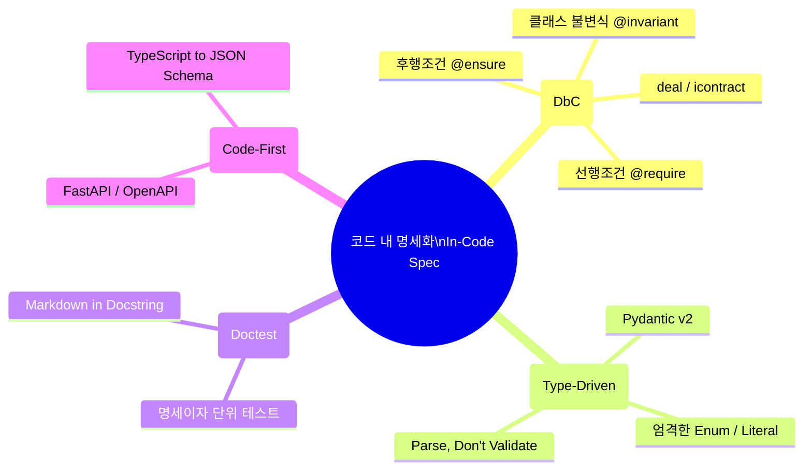

명세 중심 개발(Spec-Driven Development, SDD)을 실천하다 보면 엔지니어라면 누구나 다음과 같은 근본적인 질문과 마주하게 됩니다.

> **"마크다운 문서와 코드가 물리적으로 분리되어 있으면, 제아무리 엄격하게 룰을 세워도 언젠가는 동기화 비용이 발생하고 괴리가 생기지 않는가?  
> 그렇다면 아예 소스 코드 내부에 명세(Spec)를 100% 임베딩할 수는 없을까?"**

이러한 직관은 소프트웨어 공학의 역사에서 결코 새로운 것이 아닙니다. 1984년 도널드 커누스(Donald Knuth)의 **문학적 프로그래밍(Literate Programming)**부터, 1986년 버트란드 마이어(Bertrand Meyer)가 제창한 **계약에 의한 설계(Design by Contract, DbC)**, 그리고 현대의 **타입 주도 개발(Type-Driven Development)**에 이르기까지, *"코드 자체가 곧 명세여야 한다(Code as Specification)"*는 이상은 지난 40년간 가장 치열하게 탐구되어 온 주제입니다.

특히 AI 코딩 에이전트가 코드를 읽고 쓰는 오늘날, 이 개념은 다시금 강력한 실천 전략으로 부상하고 있습니다.

본 글에서는 코드 내에 명세를 녹여내는 핵심 기술 방법론부터, 이 방식이 지닌 결정적 장점과 치명적인 한계, 그리고 글로벌 테크 진영이 도달한 실전 종착지인 **'2계층 하이브리드 명세 모델(Two-Tier Living Spec)'**을 구체적인 파이썬 코드 예제와 함께 정리합니다.

---

### 1. 코드에 명세를 담는 4대 핵심 기술 방법론

현대 소프트웨어 공학에서 "코드 자체를 실행 가능한 명세(Executable Specification)"로 격상시키는 대표적인 기술적 접근법 4가지입니다.



#### ① 계약에 의한 설계 (Design by Contract, DbC)
* **핵심 철학**: 함수나 메서드를 단순한 코드 블록이 아니라 클라이언트와 서버 간의 **법적 계약(Contract)**으로 취급합니다.
* **구성 요소**:
  * **선행 조건(Precondition, `@require`)**: 함수 호출 전에 호출자가 반드시 만족해야 하는 조건 (위반 시 호출자 버그).
  * **후행 조건(Postcondition, `@ensure`)**: 함수 실행 완료 후 함수가 보장해야 하는 결과의 조건 (위반 시 함수 구현체 버그).
  * **불변식(Invariant, `@invariant`)**: 클래스 인스턴스가 수명 주기 내내 항상 유지해야 하는 상태 규칙.
* **주요 도구**: Python의 `icontract`, `deal`, Eiffel, D 언어 내장 계약.
* **효과**: *"이 함수는 HP가 0~1 사이여야 하고, 반환 시 지연시간이 5ms 미만이어야 한다"*는 비즈니스 규칙이 주석이 아닌 **실제 런타임 예외와 정적 검증을 일으키는 실행 가능한 명세**가 됩니다.

#### ② 타입 주도 개발 (Type-Driven Development) & "Parse, Don't Validate"
* **핵심 철학**: 검증 로직을 `if-else` 문으로 분산시키는 대신, **비즈니스 제약 조건을 타입 정의 자체에 녹여내는 방식**입니다.
* **주요 도구**: `Pydantic v2`, `Typeguard`, `MyPy/Pyright`, TypeScript Branded Types.
* **효과**: `user_id: str`, `hp: float` 같은 느슨한 원시 타입 대신, `Annotated[float, Field(ge=0.0, le=1.0)]`처럼 제약을 명시하면, 잘못된 데이터는 시스템 경계(Parsing 단계)에서 진입 자체가 원천 차단됩니다.

#### ③ 실행 가능한 독스트링 (Doctest & Living Documentation)
* **핵심 철학**: 함수의 독스트링(Docstring) 안에 기획 의도와 입출력 예시를 파이썬 REPL 형태로 작성하고, 테스트 러너(`pytest --doctest-modules`)가 이 문서를 직접 실행하여 검증합니다.
* **효과**: 문서에 적힌 예시 코드가 실제 코드의 동작과 조금이라도 달라지면 CI 빌드가 즉시 실패하므로 문서가 낡아 부패하는 현상을 방지합니다.

#### ④ 코드 우선 스키마 리플렉션 (Code-First Schema Reflection)
* **핵심 철학**: FastAPI, tRPC, Prisma처럼 파이썬 클래스와 타입 힌트를 작성하면, 프레임워크가 이를 런타임에 리플렉션하여 OpenAPI(Swagger) 명세서나 클라이언트 SDK를 자동으로 역생성합니다.

---

### 2. 코드 내 명세화(In-Code Spec)의 강력한 장점

코드와 명세를 단일 소스로 융합했을 때 얻을 수 있는 이점은 매우 명확합니다.

1. **동기화 드리프트 제로 (Zero Drift)**:
   * 명세와 구현이 동일한 파일의 동일한 함수에 붙어 있으므로, "코드는 고쳤는데 문서를 수정하지 않아 시스템이 꼬이는 문제"가 근본적으로 사라집니다.
2. **기계 검증 가능성 (Machine-Verifiable)**:
   * 마크다운 텍스트는 오타가 나거나 규칙이 모순되어도 컴파일러가 잡아낼 수 없습니다. 반면 코드 내 명세는 정적 분석기(MyPy)와 런타임 계약 검사기가 즉시 위반 여부를 잡아냅니다.
3. **AI 에이전트의 환각(Hallucination) 방지**:
   * AI가 함수를 수정할 때 데코레이터에 붙은 계약(`@ensure`)과 타입 힌트를 같은 컨텍스트에서 직접 보면서 작업하므로, 엉뚱한 변수를 조작하거나 제약 조건을 깨뜨리는 코드를 생성할 수 없습니다.

---

### 3. 그러나 피할 수 없는 현실적인 한계 (The Trade-offs)

그렇다면 왜 모든 소프트웨어를 100% In-Code Spec으로만 개발하지 않는 것일까요? 여기에는 엔지니어링의 본질적인 한계가 존재합니다.

```
❌ "나무는 보되 숲을 잃는다 (Micro vs Macro)"
   함수의 선행/후행 조건은 코드에 담을 수 있지만, 
   '왜 이 기능을 만드는가(Why)', '사용자 감정 여정', '윈도우 OS HUD 투명도 정책' 같은 
   거시적 아키텍처와 비즈니스 의도는 코드 데코레이터에 다 담을 수 없습니다.

❌ 비개발 직군(기획자, 디자이너, 도메인 전문가)과의 소통 단절
   게임 기획자나 사업 담당자가 파이썬 데코레이터와 Pydantic 정규식을 직접 읽고 
   기획을 리뷰할 수는 없습니다.

❌ 극심한 코드 노이즈와 컨텍스트 과부하 (Context Bloat)
   실제 핵심 비즈니스 로직은 5줄인데, 상단에 붙은 계약 데코레이터와 타입 선언이 
   30줄을 차지하여 코드의 가독성을 심각하게 해치고 AI 컨텍스트 토큰을 낭비합니다.
```

---

### 4. 최신 엔지니어링의 정답: 2계층 하이브리드 명세 모델

글로벌 테크 진영이 도달한 균형점은 **"모든 것을 코드에 넣거나, 모든 것을 문서에 넣는 양극단을 피하고, 명세를 2개의 계층(Macro vs Micro)으로 분리하는 것"**입니다.

| 구분 | 계층 1: 거시 명세 (Macro Spec) | 계층 2: 미시 명세 (Micro Spec) |
| :--- | :--- | :--- |
| **핵심 질문** | **Why & What (왜, 무엇을, 어떤 맥락으로)** | **How & Contract (정확한 제약, 상태, 불변식)** |
| **관리 위치** | **마크다운 문서** (`docs/specs/PRD.md`) | **소스 코드 내부** (`Pydantic` + `icontract`) |
| **주요 독자** | 인간 기획자, 디자이너, 소프트웨어 아키텍트 | **AI 코딩 에이전트, 컴파일러, 단위 테스트** |
| **담기는 내용** | • 기획 의도 및 사용자 여정 (User Flow)<br>• 화면 HUD UI/UX 및 오버레이 정책<br>• 시스템 간 데이터 흐름 (Mermaid)<br>• 비기능 목표 (CPU 점유율 3% 미만) | • 이벤트 데이터 스키마 (`PlayerGameStatus`)<br>• 상태 머신 열거형 (`EmotionState`)<br>• 함수 선행/후행 조건 (`@require`, `@ensure`)<br>• 쿨다운 수치 및 레이턴시 상한선 |

이 구조를 취하면, **기획자와 아키텍트는 마크다운으로 큰 그림(Macro)을 조율하고, 개발자와 AI는 코드 내 계약(Micro)을 통해 단 1ms의 틈도 없는 견고한 구현체**를 완성할 수 있습니다.

---

### 5. 실전 구현 예제: 게임 AI 에이전트의 In-Code Spec 적용

다음은 게임 내 '사망 감지 및 비웃음 리액션 모듈'에 **Pydantic v2 + icontract**를 결합하여 In-Code Spec을 적용한 완전한 파이썬 구현체입니다.

```python
"""
core/reaction/death_evaluator.py
티키톡 AI - 사망 리액션 판정기 (In-Code Specification 적용 사례)
"""
from enum import Enum
from typing import Annotated, Optional
import time
from pydantic import BaseModel, Field
from icontract import require, ensure, DBC

# ========================================================
# 1. Type-Driven Spec: 타입과 스키마 자체가 비즈니스 명세
# ========================================================

class EmotionState(str, Enum):
    """캐릭터 5종 감정 상태 머신 명세 (PRD v1.0 기준)"""
    NEUTRAL = "neutral"    # 상시 관전 상태
    SMUG = "smug"          # 허무한 단일 데스 시 3.0초 유지
    ANGRY = "angry"        # 3연속 데스/위험 무시 시 3.5초 유지
    SURPRISE = "surprise"  # 클러치 성공 시 4.0초 유지
    TSUNDERE = "tsundere"  # 칭찬 거부 시 3.5초 유지


class PlayerGameStatus(BaseModel):
    """인게임 감지 데이터 계약 (Data Contract)"""
    hp_percent: Annotated[float, Field(ge=0.0, le=1.0, description="현재 HP 비율 (0.0 ~ 1.0)")]
    is_alive: bool = Field(description="생존 여부")
    recent_death_count: int = Field(ge=0, description="최근 3분간 누적 데스 수")
    time_since_last_reaction: float = Field(ge=0.0, description="직전 리액션 이후 경과 시간(초)")


class ReactionResult(BaseModel):
    """판정 결과 출력 계약"""
    triggered: bool
    target_emotion: Optional[EmotionState] = None
    audio_clip: Optional[str] = None
    cooldown_applied: float = 0.0
    latency_ms: float = Field(description="판정 연산 소요 시간(ms)")


# ========================================================
# 2. Design by Contract: 런타임/정적 검증 가능한 비즈니스 규칙
# ========================================================

class DeathReactionEvaluator(DBC):
    """
    [PRD 명세 규칙 강제 클래스]
    - 단일 데스 쿨다운: 45초
    - 연속 3회 데스 쿨다운: 90초
    - 판정 연산 지연시간: 5ms 미만 보장
    """
    COOLDOWN_SOLO_DEATH = 45.0
    COOLDOWN_STREAK_DEATH = 90.0

    @require(lambda status: status is not None, "입력 상태 데이터는 None일 수 없음")
    @ensure(
        lambda status, result: not (status.is_alive and status.hp_percent > 0.0 and result.triggered),
        "불변식 위반 방지: 정상 생존 중인 유저에게는 사망 리액션이 트리거되어서는 안 됨"
    )
    @ensure(
        lambda result: result.latency_ms < 5.0,
        "성능 제약 명세: 판정 연산은 CPU 5ms 이내에 완료되어야 함"
    )
    def evaluate(self, status: PlayerGameStatus) -> ReactionResult:
        start_time = time.perf_counter()

        # 1. 생존 중이면 즉시 스킵
        if status.is_alive and status.hp_percent > 0.0:
            latency = (time.perf_counter() - start_time) * 1000
            return ReactionResult(triggered=False, latency_ms=latency)

        # 2. 쿨다운 및 감정 결정 로직 (PRD 안티스팸 명세)
        if status.recent_death_count >= 3:
            required_cd = self.COOLDOWN_STREAK_DEATH
            target_emotion = EmotionState.ANGRY
            audio_file = "assets/audio_cache/angry_01.wav"
        else:
            required_cd = self.COOLDOWN_SOLO_DEATH
            target_emotion = EmotionState.SMUG
            audio_file = "assets/audio_cache/smug_01.wav"

        # 쿨다운 미달 시 리액션 억제
        if status.time_since_last_reaction < required_cd:
            latency = (time.perf_counter() - start_time) * 1000
            return ReactionResult(triggered=False, latency_ms=latency)

        latency = (time.perf_counter() - start_time) * 1000
        return ReactionResult(
            triggered=True,
            target_emotion=target_emotion,
            audio_clip=audio_file,
            cooldown_applied=required_cd,
            latency_ms=latency
        )
```

이 코드는 단순한 구현체가 아닙니다:
* 기획서에 명시된 **"생존자에게 비웃음 금지"**, **"5ms 이내 판정 완료"**라는 규칙이 `@ensure` 데코레이터를 통해 **기계적으로 검증되는 불변식**이 되었습니다.
* AI가 내부 로직을 수정하더라도 이 계약을 어기는 순간 테스트와 런타임에서 즉각적인 경고가 발생합니다.

---

### 6. 결론: 실전을 위한 가이드라인

1. **상위 아키텍처와 UX는 문서(`docs/specs/`)에 맡기십시오.**  
   전체 시스템의 비전, 유저 여정, 윈도우 투명창 정책 등 사람이 읽고 공감해야 하는 맥락은 마크다운이 최적입니다.
2. **경계 인터페이스와 불변식은 코드(`Pydantic` + `DbC`)에 박아 넣으십시오.**  
   데이터 포맷, 필드 유효성, 상태 Enum, 쿨다운 제약, 함수 입출력 계약은 코드 내에 선언해야 컴파일러와 AI가 이를 어기지 못합니다.

이 두 가지를 조화롭게 결합한 **2계층 하이브리드 SDD**야말로, AI 코드 생성 시대에 문서의 부패와 코드의 스파게티화를 동시에 막을 수 있는 가장 성숙한 엔지니어링 해법입니다.
