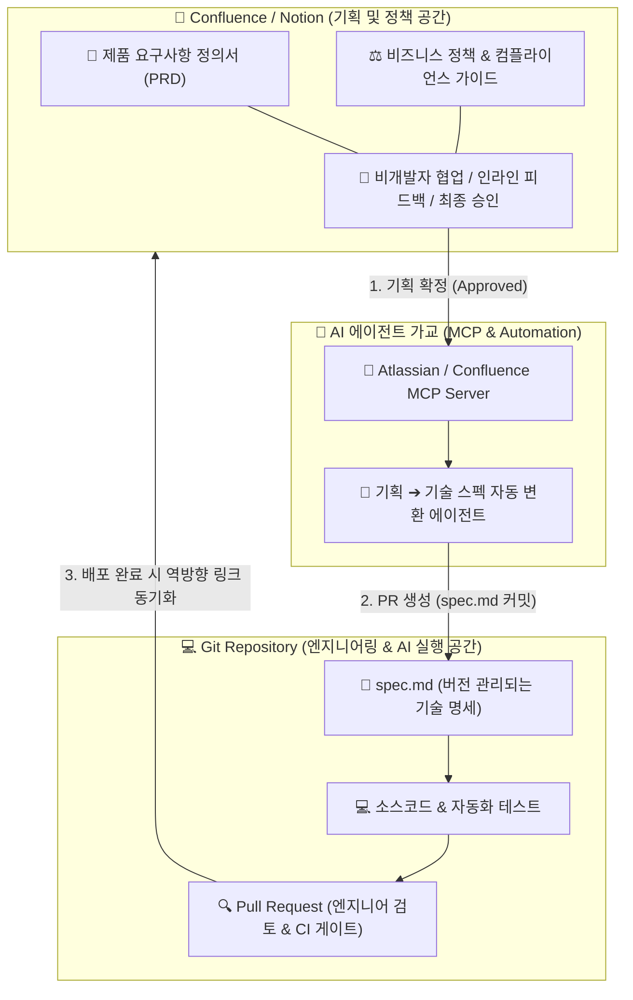

앞선 글에서는 소스코드 저장소 내부에서 기술 명세(`spec.md`)를 작성하고, 이를 바탕으로 AI 에이전트의 결과물을 검증하는 '명세 중심 개발(Spec-Driven Development)'을 다루었다. 

그러나 이 구조를 실제 조직에 그대로 대입하면 즉각적인 의문이 생긴다. 소프트웨어 개발은 엔지니어만의 작업이 아니다. 기획자(PM/PO), 프로덕트 디자이너, 법무 및 컴플라이언스 담당자, 사업 개발팀, 경영진 등 수많은 비엔지니어링 이해관계자가 함께 참여한다.

현실적으로 비개발 직군에게 Git 저장소 클론, 마크다운 문법 준수, Pull Request 검토, 터미널 환경을 요구하는 것은 무리다. 제품 기획과 비즈니스 정책, 서비스 가이드라인은 Confluence나 Notion 같은 엔터프라이즈 위키 도구에서 운영되는 것이 자연스럽다.

그렇다면 비개발 직군의 기획 환경과 엔지니어링의 코드 저장소는 어떻게 역할을 나누어야 할까. 두 환경이 분리되었을 때 생기는 고질적인 문서 부패 문제를 최신 AI 기술로 어떻게 극복하고 있는지 그 해법을 살펴본다.

---

### 1. 두 환경의 본질적 차이: '모든 문서의 코드화'가 부딪힌 현실

과거 기술 업계에서는 'Docs-as-Code(코드로서의 문서화)' 운동이 유행했다. 기획서부터 API 문서까지 모든 사내 문서를 마크다운으로 작성해 Git 레포지토리에 넣자는 주장이었다. 그러나 이 접근법은 비엔지니어링 직군과의 협업 지점에서 번번이 실패했다. 두 환경은 애초에 해결하려는 문제와 대상이 다르기 때문이다.

| 비교 항목 | Confluence / Notion (기획 및 정책 계층) | Git Repository / Markdown (엔지니어링 실행 계층) |
| :--- | :--- | :--- |
| **주요 사용자** | 기획자(PM/PO), 디자이너, 법무, 마케터, 경영진 | 소프트웨어 엔지니어, AI 코딩 에이전트 |
| **핵심 질문** | **"무엇을, 왜 만들어야 하는가?" (Why & What)** | **"어떻게 안전하고 견고하게 구현할 것인가?" (How)** |
| **주요 문서** | 제품 요구사항(PRD), 사업 정책, 법무 가이드, 리서치 | 기술 명세(`spec.md`), API 스키마, ADR, 소스코드 및 테스트 |
| **협업 인터페이스** | 위지윅(WYSIWYG) 에디터, 실시간 동시 편집, 인라인 댓글, 멘션 | Pull Request(PR), 브랜치 분기, 커밋 히스토리, 코드 리뷰 |
| **관리 생명주기** | 문제 정의, 가설 검증, 이해관계자 간의 합의 도출 | 스프린트 구현, 빌드/배포, 버전 태깅, 릴리즈 관리 |

비개발 직군에게 중요한 가치는 빠른 공유, 시각적 레이아웃, 실시간 댓글을 통한 의견 조율이다. 반면 엔지니어링 조직에 중요한 가치는 엄격한 변경 이력 추적, 빌드 자동화, 변경 사항의 무결성 검증이다. 두 가치는 상충하므로 하나의 도구로 강제 통합하기 어렵다.

---

### 2. 전통적인 분리 운영이 초래한 고질적 병목: "지식과 코드의 단절"

기획은 Confluence에 두고 개발은 Git에서 진행하는 방식이 일반화되면서, 대부분의 조직은 다음과 같은 만성적 문제에 시달려왔다.

#### (1) 문서의 부패 (Documentation Rot)
기획 단계에서 작성된 Confluence 문서는 화려하게 시작된다. 그러나 개발 도중 예외 케이스가 발견되어 스펙이 수정되면, 코드는 바뀌지만 Confluence는 방치된다. 6개월만 지나면 Confluence 문서는 실제 시스템 동작과 전혀 다른 '거짓말'이 된다.

#### (2) 시점별 버전 추적의 부재
Confluence 문서는 대부분 '현재 시점의 단일 상태'만 보여준다. 특정 배포 버전(예: v1.4.0) 당시의 정책이 무엇이었는지, 어떤 커밋에 의해 해당 정책이 시스템에 반영되었는지 역추적하기가 불가능에 가깝다.

#### (3) AI 코딩 에이전트의 맥락 결핍 (Blind Coding)
Claude Code나 Cursor 같은 최신 AI 에이전트에게 코딩을 맡길 때, 에이전트가 로컬 저장소만 볼 수 있다면 치명적인 문제가 생긴다. Confluence에 정성껏 작성해 둔 비즈니스 제약이나 법무 정책을 알지 못해, 겉보기엔 그럴듯하지만 도메인 규칙을 정면으로 위반하는 코드를 생산한다.

---

### 3. 최신 업계 표준: 하이브리드 거버넌스 (Tiered Governance)

실리콘밸리와 선도적 엔지니어링 조직(Atlassian, Thoughtworks 등)은 이 문제를 **'하이브리드 계층화'**로 해결하고 있다. 기획과 합의는 사람이 편한 Confluence에서 시작하되, 확정된 정책은 AI 에이전트가 Git 저장소의 기계 판독형 명세(`spec.md`)로 자동 변환하여 코드와 함께 커밋 체인에 묶는 구조다.

---

### 4. 기획과 코드를 유기적으로 연결하는 3가지 실무 기술

이 하이브리드 구조가 작동하도록 뒷받침하는 핵심 기술과 워크플로우는 다음과 같다.

#### ① Model Context Protocol (MCP) 기반 실시간 지식 연동
Atlassian은 공식적으로 **Atlassian Remote MCP Server**를 공개했다. 이를 통해 Claude, Cursor, Antigravity 등의 AI 에이전트가 Confluence와 Jira에 접근할 수 있게 되었다.

개발자가 로컬 IDE에서 작업할 때 Confluence 문서를 수동으로 복사해서 프롬프트에 넣을 필요가 없다. 에이전트가 MCP를 통해 사내 Confluence의 최신 기획서와 정책 페이지를 실시간으로 검색해 읽어 들인 뒤, 해당 제약조건을 컨텍스트에 담아 코드를 작성한다.

#### ② Intent ➔ Spec 자동 변환 파이프라인
Anthropic의 AI-Native SDLC 프레임워크와 결합되는 지점이다.

1. **Stage 1 (Intent in Confluence):** 기획자와 이해관계자가 Confluence에서 자연어로 아이디어를 다듬고, 인라인 피드백을 거쳐 PRD를 승인 상태로 바꾼다.
2. **Stage 2 (Spec in Git):** 승인 이벤트가 발생하면, AI 에이전트가 Confluence 내용을 분석해 엔지니어링 저장소 규격에 맞는 마크다운 스펙(`spec.md`)과 데이터 스키마를 도출하여 Git 브랜치에 커밋하고 PR을 연다.
3. **결과:** 기획자는 친숙한 위지윅 환경에서 일하고, 엔지니어와 AI는 Git 버전 관리와 CI 자동화의 혜택을 온전히 누린다.

#### ③ 텍스트 정책을 시스템 규칙으로 바꾸는 "Policy-as-Code"
Confluence에 "개인정보는 보관 주기 만료 후 즉시 파기해야 한다"거나 "지정된 법적 상표명을 엄수해야 한다"는 정책이 있다면, 이를 사람이 매번 눈으로 대조하지 않는다. 

AI 에이전트가 정책을 읽고 레포지토리 내의 규칙 파일(`AGENTS.md`)이나 Linter, 정적 테스트 스크립트로 자동 반영한다. 이렇게 하면 Confluence의 자연어 정책이 개발 환경 내의 물리적인 검증 가드레일로 작동한다.

---

### 5. 결론: 각자의 도구를 보장하면서 AI로 연결하는 조직

기획을 무리하게 Git으로 끌고 올 필요도 없고, 개발 스펙을 Confluence에 방치해서도 안 된다. 

* **기획과 정책의 중심지는 Confluence가 맞다.** 비즈니스 조율, 법무 검토, 마케팅 협의 등 전사적 소통은 위키 환경에서 가장 빠르고 유연하게 일어난다.
* **단, 실행을 위한 기술 명세는 Git에 귀속되어야 한다.** Confluence에서 확정된 요구사항은 즉시 버전 관리되는 `spec.md`로 변환되어 코드와 동일한 커밋 체인 안에서 관리되어야 한다.
* **그 사이의 번역과 동기화는 AI 에이전트와 MCP가 맡는다.** 사람이 수동으로 문서를 옮겨 적지 않아도, 에이전트가 위키의 정책을 읽어 코드의 제약조건으로 치환한다.

비개발 직군에게는 그들에게 가장 편리한 도구를 보장하고, 엔지니어링 조직에는 엄격한 버전 관리를 제공하면서, 둘 사이의 틈을 AI 기술로 매끄럽게 메우는 것. 이것이 복잡한 엔터프라이즈 환경에서 성공적인 AI-Native 소프트웨어 개발을 구축하는 열쇠다.
