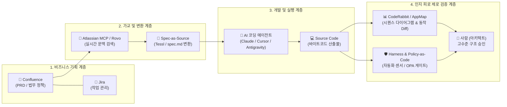

앞선 두 편의 글에서 우리는 AI 코딩 에이전트 시대의 두 가지 핵심 과제를 살펴보았다. 첫째는 AI가 대량으로 쏟아내는 코드를 사람이 일일이 검토하다 지치는 '코드 리뷰 피로'를 극복하기 위해 코드를 바이트코드로 취급하고 상위 명세를 관리하는 **명세 중심 개발(Spec-Driven Development)**이었고, 둘째는 비개발 직군의 친숙한 기획 환경(Confluence)과 엔지니어링의 엄격한 버전 관리(Git)를 현실적으로 분리·운영해야 하는 **하이브리드 거버넌스**였다.

개념적 방향성이 확립되었다면 현업 엔지니어링 리더와 실무자가 던지는 질문은 명확하다. **"그렇다면 이를 현업에서 어떤 구체적인 도구와 방법론으로 구현하고 있는가?"**

글로벌 테크 기업들과 오픈소스 진영에서 실전에 적용하고 있는 대표적인 솔루션, 구체적인 엔지니어링 방법론, 그리고 실제 기업의 적용 사례를 체계적으로 정리한다.

---

### 1. 코드 리뷰 피로를 없애는 실무 솔루션과 엔지니어링 방법론

사람이 수십 개의 파일에 걸친 코드 텍스트 Diff를 한 줄씩 따라가며 논리 오류를 찾는 방식은 이미 한계에 도달했다. 최신 도구들은 리뷰어의 시각을 **'상위 명세의 충족 여부'**와 **'시스템 동작 및 호출 흐름의 시각화'**로 끌어올린다.

#### (1) Tessl: Spec-as-Source 플랫폼의 선두주자
* **배경:** 전 세계 1위 개발자 보안 유니콘 기업 Snyk의 창업자 Guy Podjarny가 설립하여 1억 2,500만 달러 투자를 유치한 AI-Native 개발 플랫폼이다.
* **구체적 작동 방식:**
  * **`.tessl/` 디렉터리 기반 명세 관리:** 개발자가 기능을 만들 때 코드를 직접 작성하지 않는다. 요구사항, 아키텍처 제약, 데이터 계약을 기술한 정형 명세(Spec) 파일을 먼저 작성한다.
  * **Tessl Registry (스펙 레지스트리):** 오픈소스 라이브러리와 사내 공통 모듈의 버전별 'AI 에이전트 최적화 스펙'을 제공한다. 에이전트가 엉뚱한 구버전 API를 쓰거나 존재하지 않는 함수를 날조(Hallucination)하는 문제를 원천적으로 방지한다.
  * **코드의 바이트코드화:** AI 에이전트가 스펙을 읽어 하위 소스코드를 컴파일하듯 일괄 생성한다. 기능 수정이 필요할 때도 코드를 직접 고치지 않고 **스펙 파일을 수정한 뒤 AI가 코드를 다시 생성(Re-generate)**하도록 유도한다.
  * **스펙 단위 자동 평가:** 스펙 내에 기능 수락 기준이 포함되어 있어, 생성된 코드가 명세를 만족하는지 파이프라인에서 자동으로 검증한다.

#### (2) CodeRabbit: PR 텍스트 Diff를 시퀀스 다이어그램으로 시각화
* **특징:** 개발팀이 가장 고통받는 "복잡한 컴포넌트 간 상호작용 검토"를 **시각적 다이어그램**으로 자동 변환해 주는 솔루션이다.
* **구체적 작동 방식:**
  * 개발자가 PR을 열면, CodeRabbit AI가 코드 변경 내역을 분석하여 서비스 간 호출 흐름을 **Mermaid 시퀀스 다이어그램**으로 자동 렌더링하여 PR 본문에 인라인으로 첨부한다.
  * 리뷰어는 20~30개 파일에 흩어진 수백 줄의 텍스트 Diff를 일일이 대조할 필요가 없다. 상단의 시퀀스 다이어그램 하나만 보고 *"컨트롤러 ➔ 인증 서비스 ➔ 결제 게이트웨이 ➔ DB 트랜잭션"* 흐름이 정상인지 수초 만에 직관적으로 파악한다.

#### (3) AppMap: 텍스트가 아닌 실제 실행 경로를 대조하는 Behavioral Diff
* **개념:** 코드가 어떻게 생겼는가(문법)가 아니라, **"실제 런타임 실행 경로와 시스템 동작이 어떻게 달라졌는가(동작)"**를 시각화하는 도구다.
* **구체적 작동 방식:**
  * CI 파이프라인에서 테스트 코드가 실행될 때, 함수 호출·HTTP 요청·SQL 쿼리의 실행 궤적(Execution Trace)을 기록한다.
  * PR이 생성되면 이전 버전과 비교하여 **"새로 추가된 데이터베이스 쿼리", "변경된 API 호출 경로", "의도치 않은 N+1 쿼리 발생 여부"**를 인터랙티브 맵 형태로 시각적 대조(Behavioral Diff)하여 리포트한다.
  * 리뷰어는 코드를 머릿속으로 시뮬레이션하지 않고, 시스템 동작 그래프의 변화만 보고 머지 여부를 판단한다.

#### (4) Thoughtworks의 "하네스 엔지니어링 (Harness Engineering)"
* **제안자:** Thoughtworks 디스틴귀시드 엔지니어 Birgitta Böckeler.
* **핵심 철학:** "AI 에이전트가 작성한 코드를 인간이 다 읽으려 하지 마라. AI가 벗어날 수 없는 안전 울타리(Harness)를 구축하라."
* **실무 구성 요소:**
  * **가이드 (Guides - 사전 제약):** `AGENTS.md`, 정적 타입 시스템, 엄격한 린터, 아키텍처 경계 규칙(예: 프레젠테이션 계층에서 DB 직접 호출 금지).
  * **센서 (Sensors - 사후 검증):**
    * **변이 테스트 (Mutation Testing):** 테스트 스위트 자체가 AI의 미묘한 로직 실수를 실제로 잡아낼 수 있는지 검증력 측정.
    * **불변식 검사 (Invariant Check) & BDD:** 핵심 비즈니스 불변 조건을 통과하는지 CI 게이트에서 기계적으로 판정.
  * **인간의 역할:** 사람이 코드를 감시하지 않고, **"이 센서(테스트와 계약)가 비즈니스 리스크를 충분히 대변하고 있는가?"**만 검토한다.

---

### 2. 기획(Confluence)과 개발(Git)을 잇는 하이브리드 거버넌스 솔루션

비개발 직군(PM, 디자이너, 법무)의 친숙한 위키 환경과 엔지니어의 엄격한 버전 관리(Git) 사이의 단절을 막기 위해, 최신 엔터프라이즈 환경은 AI를 '양방향 번역기'로 활용한다.

#### (1) Atlassian Remote MCP Server & Rovo Dev
* **현황:** Atlassian이 공식 출시한 기업용 AI 연동 생태계다.
* **핵심 메커니즘:**
  * Claude Code, Cursor, VS Code, Antigravity 등의 AI 클라이언트가 Atlassian Remote MCP 서버와 직접 통신한다.
  * `confluence_search`, `confluence_get_page`, `jira_get_issue` 등의 툴을 통해, AI 에이전트가 로컬 파일뿐만 아니라 사내 Confluence의 최신 PRD/정책 페이지를 실시간으로 직접 검색하고 읽어 들인다.
* **Rovo Dev in Jira 워크플로우:**
  * 기획자가 Confluence에서 작성한 PRD를 Jira 티켓과 연결한다.
  * 개발자가 Jira에서 Rovo Dev 세션을 실행하면, 에이전트가 Confluence 기획서의 배경과 제약조건을 흡수한 상태로 코드를 생성하고, 자동으로 GitHub/Bitbucket에 PR을 열고 Jira 이슈 상태를 업데이트한다.

#### (2) Swimm: Living Documentation & Code Coupling
* **특징:** Confluence 위키의 텍스트와 Git 저장소의 실제 소스코드 라인을 **양방향으로 결합(Live-sync)**해 주는 솔루션이다.
* **구체적 작동 방식:**
  * 정책/기획 문서 안에 실제 코드 스니펫이나 규칙을 결합해 둔다.
  * 개발자가 Git에서 코드를 수정하여 기획 문서의 내용과 어긋나면, **Swimm이 CI 단계에서 PR 머지를 차단(Check failure)**하거나 문서를 자동 업데이트하도록 제안한다. "코드는 바뀌었는데 문서는 6개월 전 상태로 방치되는 현상"을 시스템적으로 막아낸다.

#### (3) Policy-as-Code (Open Policy Agent / Semgrep)
* **개념:** Confluence에 텍스트로 적힌 법무/컴플라이언스 가이드라인을 기계가 실행 가능한 코드로 자동 변환하는 체계다.
* **예시:**
  * Confluence 정책: *"유럽 유저의 개인정보는 동의 철회 후 30일 이내에 영구 삭제되어야 하며 로그에 평문 마스킹 없이 남아서는 안 된다."*
  * 구현: 이 정책을 사람이 감시하지 않고, Git 저장소 내의 **Semgrep 보안 규칙** 또는 **OPA(Open Policy Agent) 정책 파일(`policy.rego`)**로 등록해 둔다.
  * AI 에이전트가 코드를 짤 때 이 규칙을 위반하면 CI 빌드가 즉시 중단된다.

---

### 3. 실제 기업 적용 사례 (Real-World Enterprise Cases)

#### 🏢 사례 A: Atlassian 사내 개발팀의 "Teamwork Graph" 적용
* **문제:** Confluence에 기획 의도와 기술 문서가 수만 페이지 쌓여 있으나, 개발자가 일일이 찾아보기 힘들어 매번 슬랙으로 묻거나 기존 정책을 위반하는 코드를 작성하는 문제가 발생했다.
* **해결책:** Jira + Confluence + Bitbucket을 묶는 **Teamwork Graph**를 Rovo AI에 탑재했다.
* **결과:** 개발자가 IDE에서 별도로 문서를 찾지 않아도, AI가 현재 작업 중인 티켓과 연관된 Confluence PRD 문서를 자동으로 찾아 컨텍스트로 주입한다. 개발자의 컨텍스트 스위칭 시간이 40% 이상 감소했다.

#### 🏢 사례 B: 글로벌 핀테크 유니콘 기업의 거버넌스 파이프라인
* **문제:** 금융 규제, 환불 정책, 결제 수수료율 등 복잡한 비즈니스 룰이 수시로 바뀌는데, AI 코딩 도구를 도입하면서 에이전트가 예전 수수료율이나 폐기된 약관을 기반으로 코드를 짜는 금융 사고 위험이 커졌다.
* **해결책 (3단계 하이브리드 파이프라인 구축):**
  1. **기획/법무:** Confluence의 '결제 및 금융 규제 정책' 페이지를 공식 원본으로 관리한다.
  2. **동기화:** 기획 페이지가 승인(Approved) 상태로 변경되면 Webhook이 트리거되어, 사내 LLM이 Git 저장소 내의 `financial_rules.json` 및 `spec.md`를 자동 갱신하는 PR을 생성한다.
  3. **코드 검증:** AI 코딩 에이전트는 로컬에 동기화된 `financial_rules.json` 계약만 참조하여 결제 로직을 구현하고, CI 테스트가 계약 불일치를 100% 검증한다.

---

### 4. 종합: 엔드투엔드 AI-Native 아키텍처 청사진

두 축을 하나의 통합된 엔터프라이즈 워크플로우로 연결하면 다음과 같은 구조가 완성된다.

---

### 5. 요약 및 권장 실무 가이드라인

1. **도구의 분리를 인정하라:**  
   비개발자에게 무리하게 Git을 강요하지도 말고, 개발용 기술 명세를 Confluence에 방치해서도 안 된다. 비개발자는 Confluence에서, 엔지니어는 Git에서 일하는 것이 조직적 마찰을 없애는 최선의 길이다.
2. **AI를 두 세계의 번역기(Bridge)로 삼아라:**  
   사람이 위키 문서를 보고 손으로 코드로 옮기려 하면 문서 부패가 일어난다. **Atlassian MCP**와 **Tessl 같은 스펙 플랫폼**을 활용해 위키의 정책을 Git의 기계 판독 명세(`spec.md`)로 자동 동기화해야 한다.
3. **리뷰의 추상화 수준을 높여라:**  
   텍스트 줄바꿈을 확인하는 리뷰에서 벗어나야 한다. **CodeRabbit의 시퀀스 다이어그램**과 **AppMap의 런타임 동작 차이(Behavioral Diff)**를 확인하고, **하네스 테스트(Sensors)** 통과 여부로 품질을 보증하는 체계를 갖추는 것이 지속 가능한 AI-Native 개발의 핵심이다.
