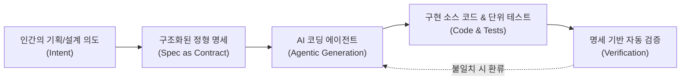

AI 코딩 에이전트(Cursor, Claude Code, GitHub Copilot, Antigravity 등)가 대중화되면서, 프롬프트 몇 줄로 수백 줄의 코드를 순식간에 뽑아내는 이른바 **'바이브 코딩(Vibe Coding)'**이 한동안 개발 생태계를 뒤흔들었습니다.

그러나 프로젝트의 규모가 조금만 커지고 비즈니스 로직이 복잡해지는 순간, 바이브 코딩은 필연적으로 거대한 엔지니어링 장벽에 부딪힙니다. 세션이 바뀔 때마다 AI가 기존 설계를 잊어버려 발생하는 **아키텍처 드리프트(Architectural Drift)**, 생성된 수천 줄의 코드를 사람이 역공학하듯 검토하느라 발생하는 **인지 과부하(Cognitive Overload)**, 그리고 코드는 계속 변하는데 문서는 방치되어 시스템의 전체 구조를 아무도 모르게 되는 **'레거시의 고속 양산'**이 대표적입니다.

이러한 한계를 극복하기 위해 Martin Fowler, Thoughtworks, Tessl, GitHub 등 글로벌 소프트웨어 공학 진영에서 가장 주목받는 대안으로 자리 잡은 방법론이 바로 **명세 중심 개발(Spec-Driven Development, SDD)**입니다.

본 글에서는 SDD의 개념적 정의부터 최신 글로벌 트렌드, 현업 엔지니어링 팀의 5대 Best Practices, 그리고 실제 프로젝트에 바로 적용할 수 있는 컴포넌트 명세 템플릿까지 체계적으로 정리합니다.

---

### 1. Spec-Driven Development(SDD)란 무엇인가?

> **"코드가 아니라 '명세(Specification)'가 프로젝트의 단일 진실 공급원(Single Source of Truth, SSOT)이자 실행 가능한 계약(Executable Contract)이다."**

SDD는 코드를 직접 작성하거나 임시변통식 프롬프트를 난사하기 전에, 시스템의 **의도(Intent), 제약 조건(Constraints), 입출력 인터페이스(Data Contracts), 상태 전이(State Machine), 그리고 성공 기준(Acceptance Criteria)**을 구조화된 명세 문서로 먼저 엄격하게 정의하는 개발 방법론입니다.

여기서 명세(Spec)는 단순한 워드 문서나 기획서에 머무르지 않습니다. AI 에이전트가 코드를 생성하고, 리팩토링하고, 테스트를 통과시키는 **'실행 가능한 기준선(Executable Baseline)'** 역할을 수행합니다.



#### 개발 패러다임 비교

| 비교 항목 | 전통적 개발 (Code-First) | 바이브 코딩 (Prompt-First) | 명세 중심 개발 (Spec-Driven) |
| :--- | :--- | :--- | :--- |
| **단일 진실 공급원 (SSOT)** | Git에 커밋된 소스 코드 | 최근 AI 대화창의 응답 (휘발성) | **버전 관리되는 구조화된 Spec 파일** |
| **요구사항 변경 시** | 소스 코드를 직접 수정/패치 | 대화창에 추가 땜빵 프롬프트 입력 | **Spec 먼저 수정 $\to$ AI가 코드/테스트 재정렬** |
| **코드베이스 복잡도** | 인간 개발자의 역량에 비례 | **급격한 스파게티화 및 드리프트** | **엄격한 모듈 경계 유지 및 예측 가능성** |
| **개발자의 주된 역할** | 직접 타이핑하는 코더(Coder) | 즉흥적 프롬프트 엔지니어 | **설계자 및 오케스트레이터 (Architect)** |

SDD 환경에서 개발자의 역할은 '한 줄씩 코드를 짜는 사람'에서, **시스템의 경계와 불변식(Invariants)을 정의하고 AI가 계약을 준수하는지 감독하는 아키텍트이자 오케스트레이터**로 진화합니다.

---

### 2. SDD의 3단계 성숙도 모델 (Levels of Rigor)

최근 연구(arXiv, Thoughtworks)에서는 팀이 SDD를 수용하는 수준을 다음 3단계로 구분합니다.

1. **Level 1: Spec-First (명세 우선 작성)**
   * 코드를 짜기 전 사람이 비즈니스 규칙과 인터페이스를 마크다운 형태의 Spec으로 먼저 작성하고 팀 내 승인을 거칩니다.
   * AI는 이 Spec을 바탕으로 초기 코드를 생성합니다.
2. **Level 2: Spec-Anchored (명세 앵커링 및 추적성 확보)**
   * Spec이 일회성 초안으로 버려지지 않고, Git 레포지토리(`docs/specs/`) 내에서 소스 코드와 함께 영구 버전 관리됩니다.
   * AI 에이전트 세션마다 항상 해당 모듈의 Spec을 필수 컨텍스트로 주입(Anchoring)하여 맥락 유실을 원천 차단합니다.
3. **Level 3: Spec-as-Source (명세가 곧 원천 소스)**
   * 코드를 '바이트코드'처럼 취급하는 단계입니다. 사람이 코드를 직접 수정하는 것을 금기시하며, 요구사항 변경 시 **오직 Spec 파일만 수정**합니다.
   * Spec의 수정이 감지되면 CI/CD 파이프라인 또는 로컬 에이전트가 관련 코드, Pydantic/Zod 스키마, 단위 테스트를 자동으로 재컴파일하듯 동기화합니다.

---

### 3. 글로벌 엔지니어링 팀의 5대 핵심 Best Practices

성공적인 SDD 구축을 위해 실무에서 반드시 지켜야 할 5가지 핵심 원칙입니다.

#### ① 명세의 원자화 및 계층 분리 (Atomic Decomposition)
수십 페이지에 달하는 거대한 모놀리식 PRD 하나를 AI에게 통째로 던지면 컨텍스트 과부하로 인해 세부 요구사항을 누락하거나 왜곡합니다.
* **시스템 Spec (High-Level PRD)**: 전체 시스템의 아키텍처 다이어그램과 비전 기술.
* **모듈 Spec (Component Spec)**: 1~2개 단위 컴포넌트에 집중한 원자적 명세 (예: `SPEC-01_overlay_window.md`, `SPEC-02_event_detector.md`).
* **실천법**: AI 작업 1회당 1개의 원자적 Spec만 컨텍스트로 제공합니다.

#### ② 스키마 우선 계약 (Schema-First Contract)
비즈니스 로직을 구현하기 전에 **입출력 데이터 구조, 타입, Enum 상태값, 에러 코드**를 먼저 엄격하게 정의합니다.
* **실천법**: Python의 `Pydantic` 모델이나 `TypeScript` 인터페이스, `JSON Schema`를 Spec 내에 완전한 코드로 먼저 선언합니다. 데이터 계약이 고정되어 있으면 AI가 함수 내부 로직을 생성할 때 엉뚱한 필드명을 날조하는 환각(Hallucination)이 사라집니다.

#### ③ 실행 가능한 테스트와 명세의 직결 (Executable Specifications)
명세서의 인수 조건(Acceptance Criteria)은 단순한 줄글이 아니라 **테스트 케이스(Given-When-Then / BDD 스타일)**로 1:1 변환 가능한 형태로 작성되어야 합니다.
* **실천법**:
  1. Spec 작성
  2. Spec 기반으로 실패하는 단위 테스트(`test_*.py`) 먼저 생성
  3. 테스트를 100% 통과하도록 AI에게 구현 코드 작성을 지시 (TDD + SDD 결합 루프)

#### ④ 단일 진실 공급원 유지 (The Spec-First Rule)
개발 도중 버그를 발견하거나 기획 변경이 필요할 때, **절대 소스 코드를 먼저 땜빵하지 마십시오.**
* **실천법**:
  1. `docs/specs/` 내의 해당 Spec 문서를 먼저 업데이트하고 Git 커밋
  2. 업데이트된 Spec을 AI에게 전달하여 소스 코드와 테스트 케이스를 리팩토링
  *(이 규칙을 깨는 순간, 문서는 다시 레거시가 되고 시스템은 바이브 코딩 상태로 퇴보합니다.)*

#### ⑤ AI 친화적 명세 포매팅 (Agent-Ready Spec)
인간과 AI 모두에게 명확한 형식을 사용해야 합니다.
* 모호한 표현 지양 ("빠르게 반응해야 함" ❌ $\to$ "화면 사망 이벤트 감지 후 50ms 이내 오디오 버퍼 출력" ⭕)
* 복잡한 비즈니스 로직은 **Mermaid 상태 다이어그램** 또는 **상태 전이 테이블(State Transition Table)**로 도식화
* 시스템이 절대 위반해서는 안 되는 **불변식(Invariants)**과 비기능적 제약(메모리, CPU 점유율)을 명시적 체크리스트로 포함

---

### 4. 실전 컴포넌트 명세(Component Spec) 표준 템플릿

현업에서 모듈 단위 명세를 작성할 때 활용할 수 있는 표준 템플릿입니다.

```markdown
# [SPEC-0X] 모듈/컴포넌트 명칭 (Component Name)

* 문서 버전: v1.0
* 관련 상위 PRD: PRD-XXXX-001
* 책임 범위: 단일 책임 원칙(SRP)에 기반한 모듈의 명확한 역할 1줄 요약

## 1. 입출력 데이터 계약 (Data Contracts)
\`\`\`python
from pydantic import BaseModel
from enum import Enum

class ComponentState(str, Enum):
    IDLE = "idle"
    RUNNING = "running"
    ERROR = "error"

class InputPayload(BaseModel):
    event_id: str
    timestamp: float

class OutputResult(BaseModel):
    status: ComponentState
    latency_ms: float
\`\`\`

## 2. 상태 전이 및 비즈니스 규칙 (State Machine & Logic)
* State A -> State B: 트리거 조건 및 지속 시간 (ms)
* 충돌 발생 시 우선순위 해결 공식 명시

## 3. 비기능적 제약 조건 (Constraints & Invariants)
* [ ] 처리 지연시간 상한선: 50ms 이하
* [ ] 상시 메모리 점유율: 100MB 이하
* [ ] 외부 종속성: Windows API 외 서드파티 훅 금지

## 4. 실행 가능한 인수 테스트 시나리오 (Acceptance Scenarios)
* **시나리오 1: 정상 동작**
  * Given: 모듈이 IDLE 상태이고 유효한 입력이 주어졌을 때
  * When: execute() 함수가 호출되면
  * Then: RUNNING 상태로 전이되고 50ms 이내에 OutputResult를 반환해야 한다.
* **시나리오 2: 예외 처리**
  * Given: 입력 데이터의 timestamp가 음수일 때
  * When: 검증 로직이 수행되면
  * Then: ValueError 예외를 발생시키고 ERROR 상태로 기록되어야 한다.
```

---

### 5. 맺음말: AI 시대의 진정한 소프트웨어 장인정신

코딩 AI가 고도화될수록 문법을 외우고 알고리즘을 손으로 타이핑하는 능력의 희소성은 점차 낮아지고 있습니다.

반대로 **"무엇을 왜 만들어야 하는지(Intent)를 명확히 정의하고, 시스템의 경계를 우아하게 나누며, AI가 계약을 위반하지 않도록 명세와 테스트로 검증하는 엔지니어링 역량"**은 그 어느 때보다 중요해졌습니다.

바이브 코딩의 혼란에서 벗어나고 싶다면, 오늘부터 바로 Git 레포지토리에 `docs/specs/` 디렉터리를 만들고 **Spec-Driven Development**를 시작해 보시기 바랍니다. 코드는 휘발되지만, 잘 다듬어진 명세는 견고한 소프트웨어 자산으로 남습니다.
