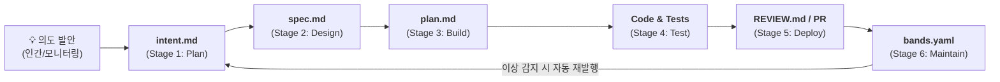

Anthropic에서 발표한 **[The AI-Native SDLC Playbook](https://claude.com/blog/the-ai-native-sdlc-playbook)**은 AI 코딩 에이전트 시대에 소프트웨어 개발 생애주기(SDLC)를 어떻게 근본적으로 재설계해야 하는지를 다룬 기념비적인 핵심 가이드입니다.

본 글에서는 이 플레이북이 제시하는 핵심 철학, 4대 역할(기획·설계·개발·QA) 관점의 주요 컨셉, 그리고 전체 프로세스를 유기적으로 엮는 아키텍처와 시사점을 정리합니다.

---

### 1. 패러다임 전환: "Code is no longer the bottleneck"

#### 📌 문제의식
* **전통적 SDLC(워터폴, 애자일)의 전제:**
  * 전통적인 개발 프로세스는 **"코드를 작성하고 구현하는 단계가 가장 비싸고 오래 걸린다"**는 전제 위에 설계되었습니다.
  * 따라서 기획 승인 위원회, 스프린트 산정 회의, 긴 설계 리뷰 등 무거운 통제 절차(Heavy Process)를 두어 구현 단계의 시행착오를 최소화하려 했습니다.
* **에이전트 AI로 인한 변화:**
  * 에이전트 AI의 도입으로 **구현(Build) 단계는 수 주/수 개월에서 수 시간 단위로 압축**되었습니다.
  * 그 결과, 개발의 병목은 구현 자체가 아니라 구현의 앞뒤 단계인 **기획(Plan), 설계(Design), 검토/테스트(Test/Review), 배포(Deploy)**라는 인간 속도의 단계로 완전히 이동했습니다.

#### 💡 해결책 (AI-Native SDLC)
* 사람이 문서를 넘겨주면 다음 사람이 처음부터 다시 파악하는 선형적(Linear) 인수인계를 폐기합니다.
* AI 에이전트가 각 단계의 초안 작성과 검증을 자율적으로 수행하고, **인간은 각 단계의 경계(Gate)에서 핵심 의사결정과 승인에 집중하는 '폐루프(Closed Loop)'** 구조를 만듭니다.

---

### 2. 핵심 연결고리: "버전 관리된 아티팩트 체인 (Artifact Chain)"

AI-Native SDLC의 모든 단계는 **Git에 커밋되는 마크다운(`.md`) 아티팩트**를 통해 다음 단계로 전달됩니다.

마크다운은 **인간도 쉽게 읽고 판단할 수 있고, 에이전트도 즉시 기계적으로 파싱하여 행동할 수 있는 공통 언어(Universal Interface)**이기 때문입니다.

이 커밋 체인 전체가 곧 **누가 무엇을 요구했고, 에이전트가 어떻게 설계/구현했으며, 누가 승인했는지에 대한 완벽한 감사 추적(Audit Trail)**이 됩니다.

---

### 3. 역할별(기획 / 설계 / 개발 / QA) 주요 컨셉 및 프랙티스

#### ① 기획 에이전트 (Stage 1: Plan) ➔ `intent.md`
* **기존 방식:** 아이디어가 백로그, 지라 티켓, 요구사항 정제 회의를 거치며 원래 의도가 왜곡되고 착수까지 수 주가 소요됨.
* **AI-Native 방식:**
  * 발안자(기획자, 현업, 운영자)가 일상 언어로 에이전트와 브레인스토밍을 진행.
  * 에이전트가 비즈니스 분석가처럼 범위, 대상 유저, 제약조건, 성공 기준을 역질문하며 정제.
  * 표준 템플릿에 맞춘 **`intent.md` (프로토 스펙)**를 자동 생성하고 Git에 커밋.
* **인간의 역할:** 기획 리드/PO는 `intent.md`를 검토하고 **승인(Merge) 또는 반려**만 결정. 승인되는 순간 설계 단계가 자동 트리거됨.

#### ② 설계 에이전트 (Stage 2: Design) ➔ `spec.md`
* **기존 방식:** 분석가가 요구사항을 쓰고 디자이너/설계자가 이를 다시 해석하여 설계를 작성. 수 주 뒤 보안/컴플라이언스 검토에서 규정 위반이 뒤늦게 발견되어 재작업 발생.
* **AI-Native 방식:**
  * 요구사항과 설계가 단일 세션으로 압축(Collapse).
  * 에이전트가 `intent.md`를 읽고, 조직의 보안·UX·브랜드 규정이 코딩된 **Skills(지능형 지침)**를 자동 적용하여 기술 스펙인 **`spec.md`**를 도출.
  * 정책 충돌이나 모호한 지점은 **Flagged Concerns(주의 구역)**로 표시하여 선제적으로 부각.
* **인간의 역할:** 설계자가 문서를 바닥부터 쓰지 않고, 에이전트가 플래그를 띄운 우려 사항 및 아키텍처 핵심 결정만 검토 후 확정.

#### ③ 개발 에이전트 (Stage 3: Build) ➔ `plan.md` & Implementation
* **기존 방식:** 개발자가 스펙을 보고 바로 코딩에 돌입. 어떤 파일이 수정되고 어떤 위험이 있는지 PR 전까지 동료들이 알 수 없음.
* **AI-Native 방식:**
  * **Plan Mode 기본화:** 코드 수정 전 반드시 변경할 파일 목록, 작업 순서, 위험 요소, 검증 증명 방법을 기술한 **`plan.md`**를 먼저 작성하고 상호 인터뷰를 통해 확정.
  * **조직 지식의 코드화 (`CLAUDE.md` / Skills):** 아키텍처 규칙, 자주 발생하는 실수 방지 패턴을 에이전트가 시작 시 자동 로드.
  * **빌드 타임 Hooks (결정적 가드레일):** 보호된 파일(생성된 코드, 레거시 모듈 등) 수정 차단, 포매터/린트 자동 실행.
  * **병렬 세션 & 서브에이전트:** Git Worktree를 활용해 개발자 1명이 여러 독립 세션을 지휘하며, 리서처(Researcher)·단순화(Simplifier)·검증자(Verifier) 등 특화 서브에이전트에게 하위 작업을 위임.

#### ④ QA 및 테스트 에이전트 (Stage 4~5: Test & Deploy) ➔ Feedback Loop & Evals
* **기존 방식:** 코드가 완성된 후 QA 팀이나 CI에 넘어가 뒤늦게 결함이 발견되어 피드백 루프가 느림.
* **AI-Native 방식:**
  * **자율 피드백 루프 (Self-Verification Loop):** 개발 에이전트가 코드를 사람에게 넘기기 전, 로컬 빌드·단위 테스트·스크린샷 비교를 스스로 반복 실행하여 100% 통과된 상태로만 결과물 제출.
  * **버그 수정 원칙:** 실패하는 테스트 코드를 먼저 커밋 ➔ 에이전트가 테스트 코드를 임의로 수정하지 못하게 Hook으로 잠근 뒤 ➔ 프로덕션 코드만 수정하여 통과하도록 강제.
  * **지능형 PR 다면 리뷰 (`REVIEW.md`):** 에이전트가 PR에 대해 3대 패스(① 로직 버그, ② 보안 취약점, ③ 스펙·플랜 일치 여부)를 자동 검토하고 심각도별로 정리. 사소한 스타일(Nit)은 상한선(예: 5개) 제한.
  * **Continuous Evals in CI:** 모델이나 에이전트 설정(`CLAUDE.md`, Skills, Hooks)이 바뀔 때 품질이 떨어지지 않았는지 실제 업무 태스크 20~50개로 구성된 리그레션 평가 스위트 운영.

#### ⑤ 운영 및 순환 (Stage 6: Maintain ➔ Closed Loop)
* 모니터링 시스템(`bands.yaml`)이 지표(테스트 실패율, 5xx 에러 등)의 이상 편차(2σ, 3σ)를 감지하면, 사람이 없어도 백그라운드 에이전트가 원인을 진단하고 **새로운 `intent.md`를 자동 발행**하여 다시 Stage 1(기획)으로 루프를 재순환시킴.

---

### 4. 우리 프로젝트(Real Seoul Myeongdong) 협업 프로세스 구축을 위한 시사점

현재 우리 프로젝트는 이미 이 플레이북의 원칙과 매우 유사한 방식을 성공적으로 경험했습니다:

* **기획 단계:** `REQUEST_POPULAR_POI_EXPANSION.md` (`intent / spec`)
* **개발 전 계획:** `implementation_plan.md` (`plan.md`)
* **검증 및 증거:** `scripts/check.ps1` (140개 테스트) + `walkthrough.md` + `M2_3_POPULAR_POI_IMPLEMENTATION.md`

이 경험을 바탕으로 향후 **4대 전문 서브에이전트(기획자, 아키텍트/설계자, 개발자, QA 엔지니어)**의 명확한 역할 정의, 입출력 아티팩트 규격, 그리고 게이트 승인 룰을 더욱 견고하게 정립할 수 있습니다.
